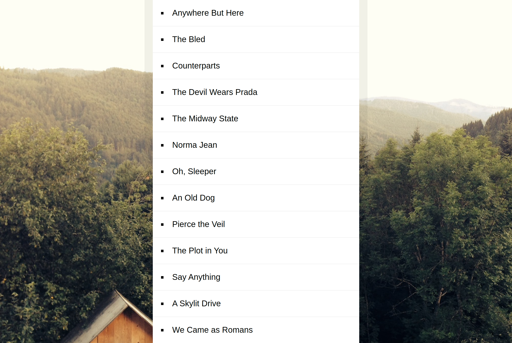

# 17-Sort-Without-Articles

## Lien de projet

https://puthpiseth.github.io/17-Sort-Without-Articles/index-START.html

## Guide

Un élément de liste non ordonné est fourni dans le fichier index.html et un tableau de chaînes est
fourni dans le script.
Pouvez-vous trier cette liste ?
Cela nécessite la suppression de certain préfixe de la chaîne : ​ The​ , ​ A ​ et ​ An ​ puis de trier les phrases
par ordre alphabétique
Afficher le résultat classés.

## Maquette

